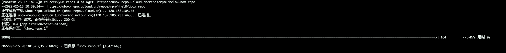
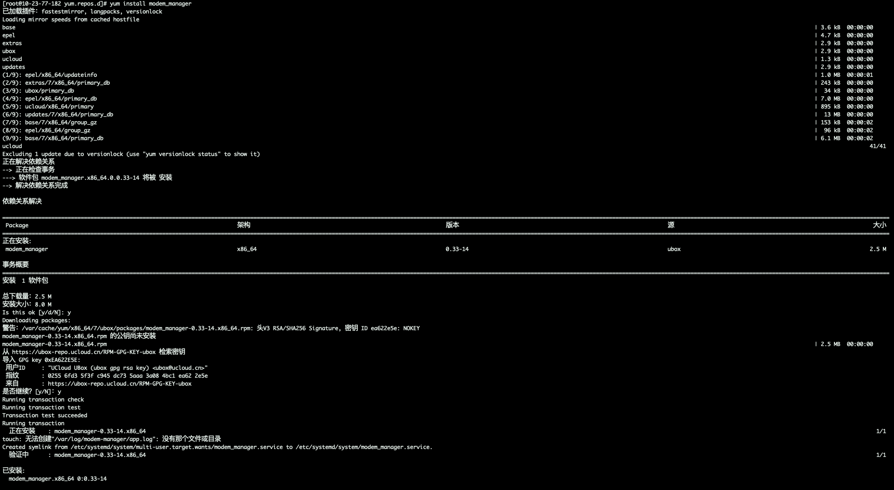

# X86架构 CentOS 7 配置过程如下

## 在终端依次执行以下指令

### - **指令1**
    cd /etc/yum.repo.d && wget  https://ubox-repo.ucloud.cn/repos/rpm/rhel8/ubox.repo
输入：`cd /etc/yum.repo.d && wget  https://ubox-repo.ucloud.cn/repos/rpm/rhel8/ubox.repo`                       
执行结果如下：
  

### - **指令2**
    yum install modem_manager

输入：`yum install modem_manager`(或自己上传的包)；
执行结果如下：
  

### **完成以上步骤则环境配置完成**
