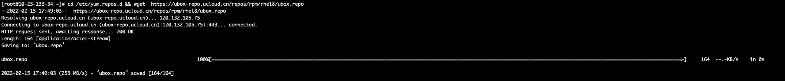
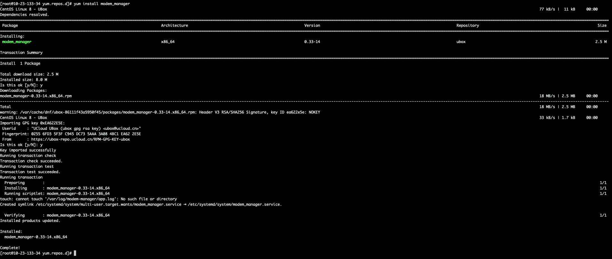

# X86架构 CentOS 8 配置过程如下

## 在终端依次执行以下指令

###  **1、输入如下指令**
    cd /etc/yum.repos.d && wget  https://ubox-repo.ucloud.cn/repos/rpm/rhel8/ubox.repo

输入:`cd /etc/yum.repos.d && wget  https://ubox-repo.ucloud.cn/repos/rpm/rhel8/ubox.repo`  下载文件                        
执行结果如下：
  

###  **2、输入如下指令**
    yum install modem_manager

输入：`yum install modem_manager` 安装 modem_manager(或自己上传的包)。安装过程中需要输入两次y
执行结果如下：
  

### **完成以上步骤则环境配置完成**