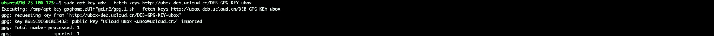
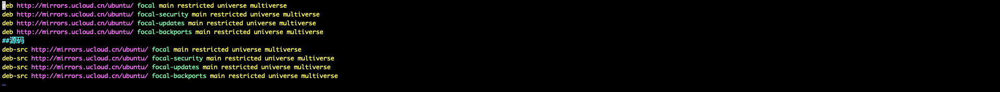
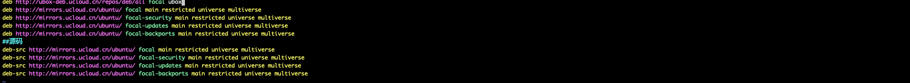
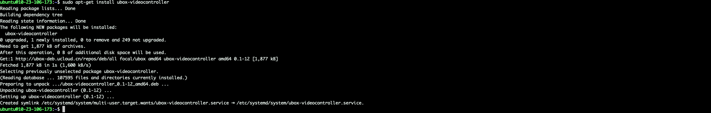

# X86架构 Ubuntu 20 配置过程如下

## 在终端依次执行以下指令

### - **1、输入如下指令**
    sudo apt-key adv --fetch-keys http://ubox-deb.ucloud.cn/DEB-GPG-KEY-ubox
                          
执行结果如下：
  

### - **2、输入如下指令**
    sudo vim /etc/apt/sources.list
执行结果如下：
  

### - **3、按“i”打开编辑模式，在文末加入以下内容,编辑结束后wq保存**
    deb http://ubox-deb.ucloud.cn/repos/deb/all focal ubox
编辑后结果如下：
  

### - **4、输入如下指令**
    sudo apt-get update
执行结果如下：
  

### - **4、输入如下指令**
    sudo apt-get install ubox-videocontroller
执行结果如下：
  

### **完成以上步骤则环境配置完成**
