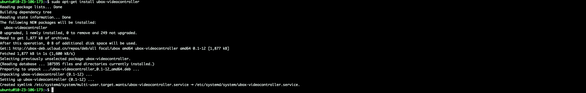

# X86架构 Ubuntu 20 配置过程如下

## 在终端依次执行以下指令

###  **1、输入如下指令**
    sudo apt-key adv --fetch-keys http://ubox-deb.ucloud.cn/DEB-GPG-KEY-ubox
输入`sudo apt-key adv --fetch-keys http://ubox-deb.ucloud.cn/DEB-GPG-KEY-ubox`获取公钥                   
执行结果如下：
  

###  **2、输入如下指令**
    sudo vim /etc/apt/sources.list
输入`sudo vim /etc/apt/sources.list`配置 source
执行结果如下：
  

###  **3、按“i”打开编辑模式，加入以下内容,编辑结束后wq保存**
    deb http://ubox-deb.ucloud.cn/repos/deb/all focal ubox
在文末输入`deb http://ubox-deb.ucloud.cn/repos/deb/all focal ubo`，编辑后保存
编辑后结果如下：
  

###  **4、输入如下指令**
    sudo apt-get update
输入`sudo apt-get update`更新软件包

###  **5、输入如下指令**
    sudo apt-get install ubox-videocontroller
输入`sudo apt-get install ubox-videocontroller`安装/升级软件包
执行结果如下：
  

### **完成以上步骤则环境配置完成**

&nbsp;
&nbsp;

# ARM架构 Ubuntu 20 配置过程如下

## 在终端依次执行以下指令

###  **1、输入如下指令**
    sudo apt-key adv --fetch-keys http://ubox-deb.ucloud.cn/DEB-GPG-KEY-ubox
输入`sudo apt-key adv --fetch-keys http://ubox-deb.ucloud.cn/DEB-GPG-KEY-ubox`获取公钥                   
执行结果如下：
  

###  **2、输入如下指令**
    sudo vim /etc/apt/sources.list
输入`sudo vim /etc/apt/sources.list`配置 source
执行结果如下：
  

###  **3、按“i”打开编辑模式，加入以下内容,编辑结束后wq保存**
    deb http://ubox-deb.ucloud.cn/repos/deb/all focal ubox
在文末输入`deb http://ubox-deb.ucloud.cn/repos/deb/all focal ubo`，编辑后保存
编辑后结果如下：
  

###  **4、输入如下指令**
    sudo apt-get update
输入`sudo apt-get update`更新软件包

###  **5、输入如下指令**
    sudo apt-get install ubox-videocontroller
输入`sudo apt-get install ubox-videocontroller`安装/升级软件包
执行结果如下：
  

### **完成以上步骤则环境配置完成**
