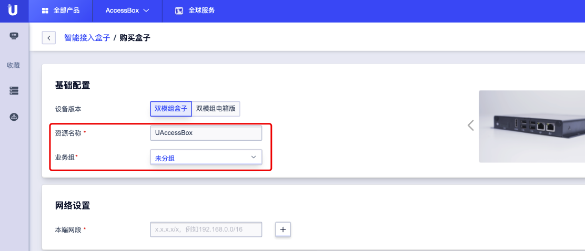

# 无人化智能盒子购买指南

本文主要介绍如何购买无人化智能盒子并获取资源ID，可根据需求选购不同规格的无人化智能盒子。

1. https://console.ucloud.cn/ 注册账户并登陆控制台页面

2. 控制台—全部产品—物联网—无人化智能盒子

   

3. 点击【购买盒子】，选择所需购买的无人化智能盒子盒子设备版本。

   

​           

4. 不同设备版本的无人化智能盒子报价如下:

   | 设备版本     | 价格/元 |
   | ------------ | ------- |
   | 双模组盒子   | 5000    |
   | 双模组电箱版 | 3170    |

5. 填写盒子【资源名称】，选择其所属的【业务组】。

   

6. 设置网段，如资源网段互相冲突或重复，则需要更改网段，详见[如何配置内网](/UBox/guide/LAN)

7. 确认无误后点击菜单右侧支付账单【立即购买】，购买成功后无人化智能盒子生成资源ID，进入激活步骤。

