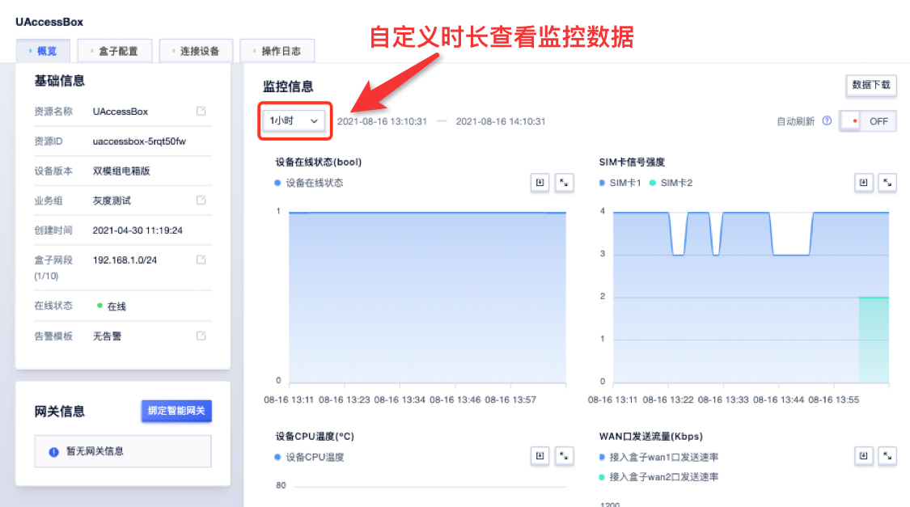
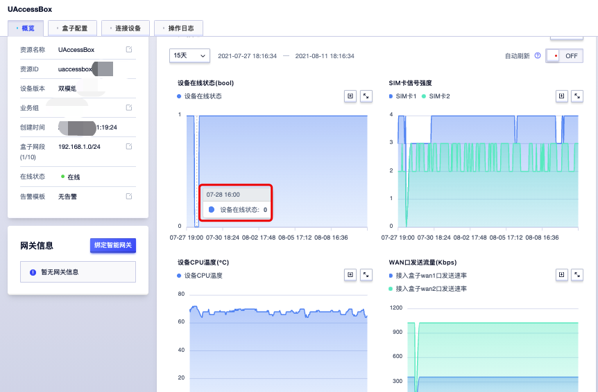
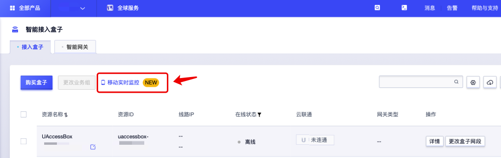
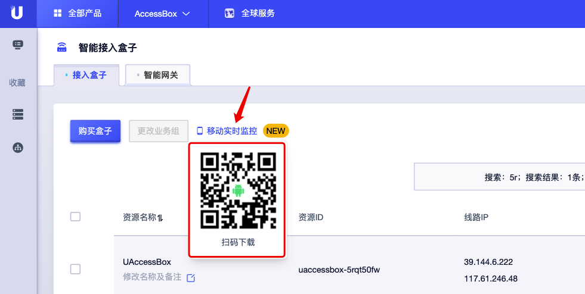
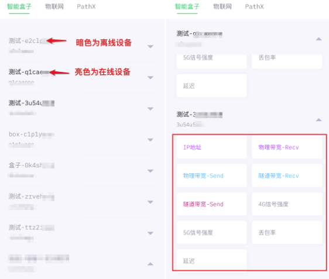
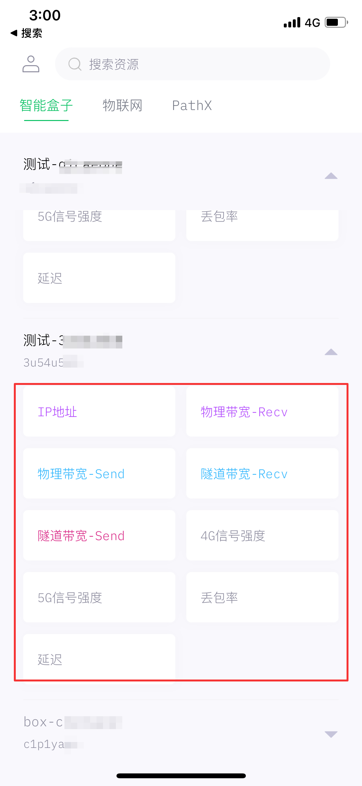

# 如何查看监控数据

## 控制台查看

1. 登陆控制台 https://console.ucloud.cn/ ，进入智能接入盒子页面。

2. 控制台—详情—概览—监控信息

3. 可通过数据监控图表，查看1小时以内的设备在线状态、 SIM卡信号强度、设备CPU温度、WAN口发送流量、WAN口接收流量数据，也可自定义日期/时段查看改时间范围内监控数据。

## 下载监控告警APP查看

1. 登陆控制台 https://console.ucloud.cn/ ，进入智能接入盒子页面。
2. 鼠标移至【移动实时监控】图标处，显示UCloud实时监控告警APP下载二维码。

3. 控制台账号登录APP，收集上报接入盒子数据指标（ip地址、信号、带宽、延迟、丢包率），展示亚秒级别数据，设备在线/离线状态以不同亮度区分。    

                      

