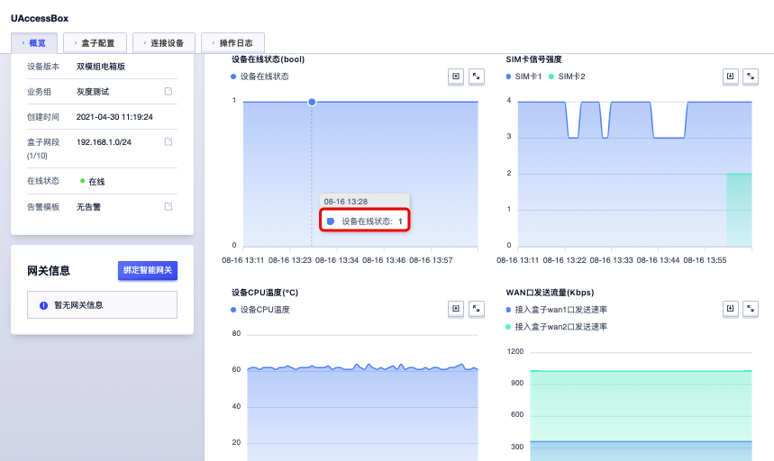
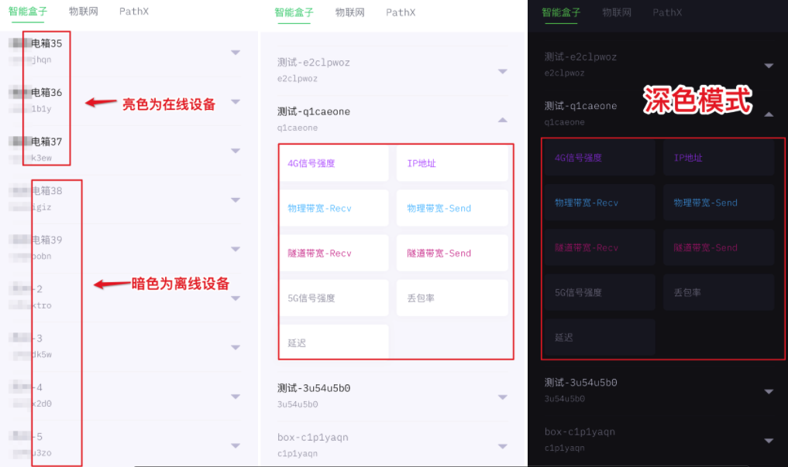

# 如何查看监控数据

## 控制台查看

1. 登陆控制台 https://console.ucloud.cn/ ，进入无人化智能盒子页面。

2. 控制台—详情—概览—监控信息

3. 可自定义日期/时段，通过数据监控图表，查看该时间范围内监控数据的设备在线状态、 SIM卡信号强度、设备CPU温度、WAN口发送流量、WAN口接收流量数据。

## 下载UCloud实时监控告警APP查看

1. 登陆控制台 https://console.ucloud.cn/ ，进入无人化智能盒子页面。
2. 鼠标移至【移动实时监控】图标处，显示UCloud实时监控告警APP下载二维码。

     

3. 移动端扫码下载后，以控制台账号登录APP，收集上报无人化智能盒子数据指标( ip地址、信号、带宽、延迟、丢包率)，展示亚秒级别数据，设备在线/离线状态以不同亮度区分，APP页面可根据手机系统自动切换浅色/深色模式。

   

   ​                                       

