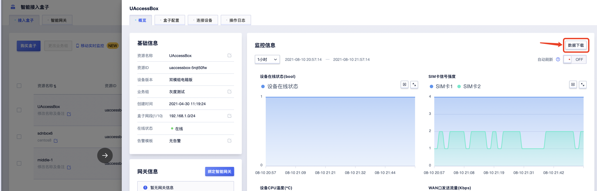

# 如何下载监控数据

## 数据下载

当需要获取接入盒子近期的使用数据、用于统计流量和排查问题时，可以在控制台接入盒子产品页下载获取数据，本文档将详细为您介绍数据下载和打开的方法。

确认需要获取数据的资源id后，在控制台找到该资源，点击【详情】进入详情页，点击右上角的【数据下载】，即可进行数据文件的下载。

## 数据文件解压

您将下载到一个tar格式的文件，文件格式如“metric_uaccessbox-5rqt50fw_1628603235”，其中“uaccessbox-5rqt50fw”代表下载数据对应的资源id，"1628603235"代表您下载数据时的时间戳。

双击tar压缩文件您将看到一个db格式的文件，这就是您需要的数据表。该文件包含该资源过去365天的数据。若资源激活未满一年，则下载内容为自激活起的全部数据。

## db文件的打开

##### 1.使用sqlite

- 输入:`cd File`，切换到您存放db文件的目录，比下图存放在/downloads目录下

- 输入：`sqlite3 + 文件名.db` 打开db文件

  

- 输入：`.table`  查看数据表                                      

##### 2.使用WorkBench、TablePlus直接打开db文件

###### WorkBench(免费，需对db文件的格式进行转化)

###### TablePlus(付费)

##### 3.数据表注释

| 表名                            | 对应数据            |
| ------------------------------- | ------------------- |
| mid_sdnbox_physical_bandwidth   | WAN口带宽（外网） |
| mid_sdnbox_signal               | 信号强度           |
| mid_sdnbox_tunnel_bandwidth     | 隧道带宽（内网） |

