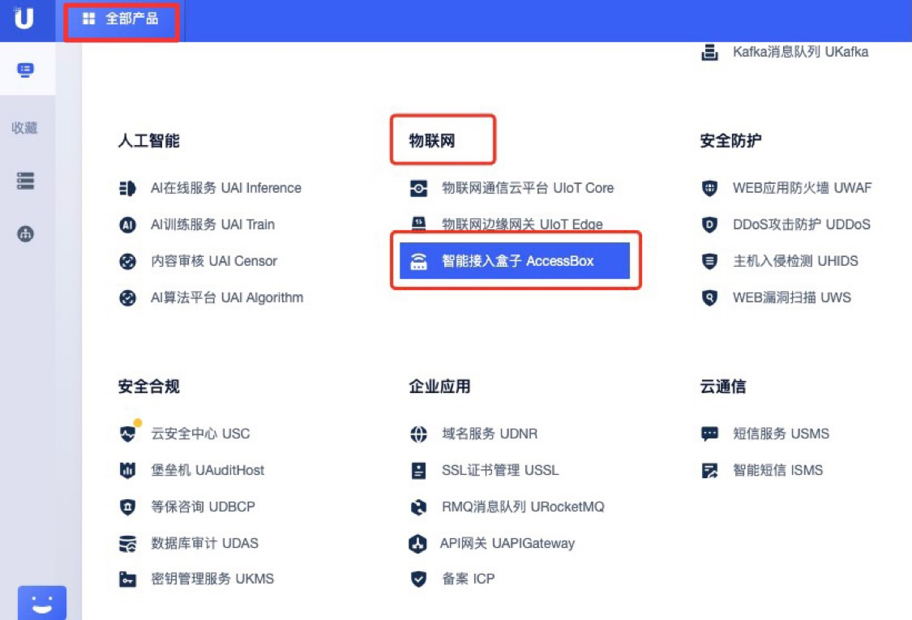
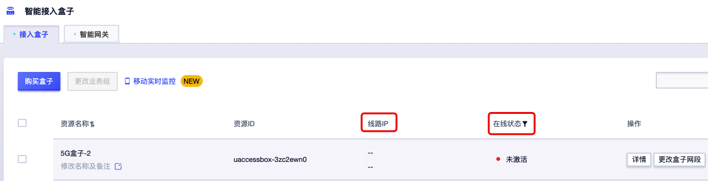
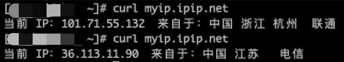

# 如何查询是否双卡

##### **方法一：控制台页面查看**

1.登陆控制台 https://console.ucloud.cn/

2.全部产品—物联网—智能接入盒子

3.查看对应ID的智能接入盒子双卡在线状态

##### **方法二：PC端查看**

1. 关闭PC网络

2. PC直连智能接入盒子LAN口，dhcp获取地址连接到盒子网络

3. PC端多次输入： `curl myip.ipip.net`

4. 查看双卡线路ip和运营商信息，如连续多次显示同一个线路ip则表明单卡在线     

