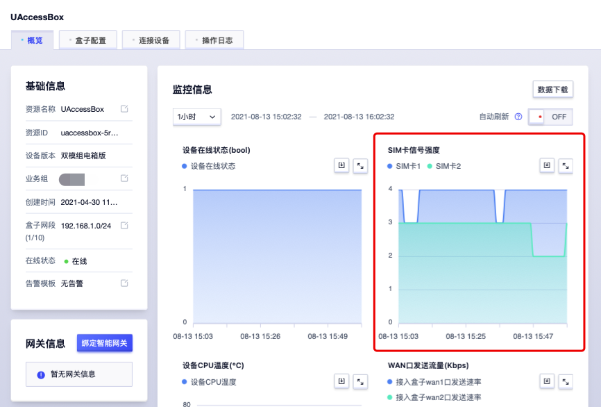
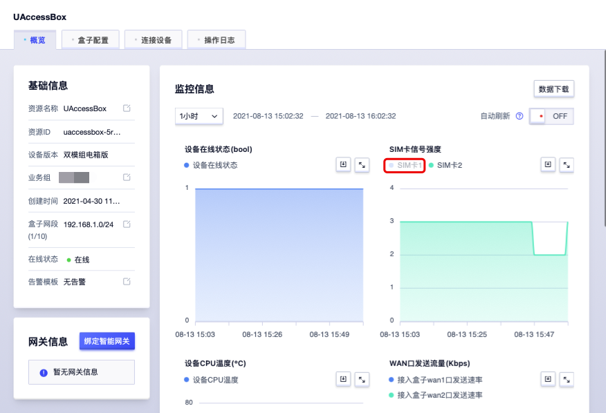
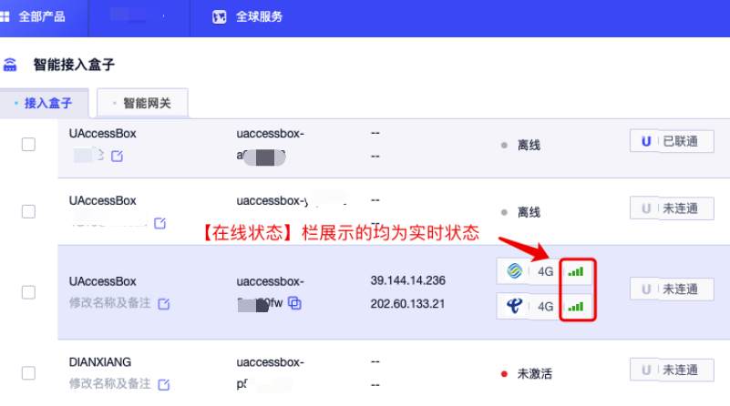

# 如何查询双卡信号值

## 详情页查看

1. 登陆控制台https://console.ucloud.cn/ ，进入智能接入盒子页面。
2. 控制台—详情—概览—监控信息
3. 监控信息页查看SIM卡1小时内双卡信号强度图标数据。

4. 单击下方颜色标识的SIM卡1/SIM卡2可取消其监控信息数据，查看单卡信号强度数据。下图所示为点击取消SIM卡1，仅展示SIM卡2的单卡数据信息。

## 在线状态栏查看

1. 登陆控制台https://console.ucloud.cn/ ，进入智能接入盒子页面。
2. 找到所需查看的设备所对应资源ID，其右侧【在线状态】栏可直接查看双卡信号格数及网络状态，不同信号格数由该卡当前获取的信号rsrp值转化成格数，4G模组信号格数所对应rsrp值如下表注释。

##      

## 4G信号注释

| LTE_RSRP区间 | 信号/格 |
| ------------ | ------- |
| —85 ～ —43   | 4       |
| —95 ～ —86   | 3       |
| —105 ～ —96  | 2       |
| —114 ～ —106 | 1       |
| —140 ～ —115 | 0       |

