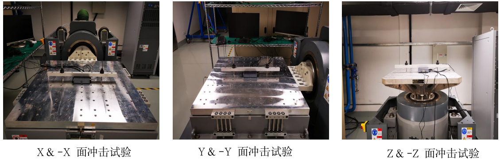

# 冲击试验 (关机状态测试)

#### 实验目的：

1. 确定在正常温度下，当产品受到一系列冲击时，各性能是否失效。
2. 确定机械的薄弱环节，考核产品结构的完整性。

#### 参考标准：
IEC60068-2-27:2008《电工电子产品环境试验 第27部分 试验Ea：冲击》
注：IEC标准是 ( International Electrotechnical Commission)国际电工委员会标准的简称。

#### 测试日期：
2021.10.12

#### 试验场地：
苏州源控电子科技有限公司-硬件可靠性实验室

#### 实验室环境：
温度: 25±10℃   湿度: 50±25 % RH

#### 测试设备：
振动试验机 (YK-06)  设备品牌: 苏州苏试试验仪器有限公司 设备模型: DC-2200-26

#### 测试条件：

1. 加速度：10G 
2. 脉冲宽度：11ms 
3. 系统条件：运行模式 
4. 测试轴向：-X, -Y, -Z, X, Y, Z 轴 
5. 测试频率：3 次/面

#### 测试照片：

## 数据分析
###### 冲击测试数据来源：振动试验机 (YK-06)

上图为UBox所处环境的冲击力度数据，冲击测试实验曲线。
注：冲击测试主要目的为确定机械的薄弱环节，考核产品结构的完整性。所以本实验测试时系统保持关机状态。

## 综合分析

1. 硬件功能未受损。
2. 硬件未发现退化。
3. 性能保持不变，未见不可逆的物理损坏或退化。
4. 各模块连接保持完好，无松动现象。