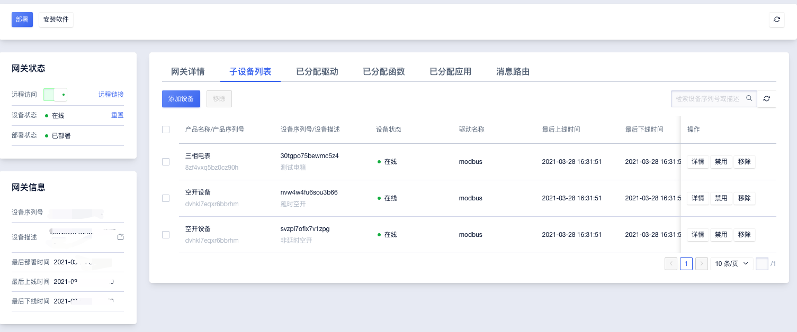
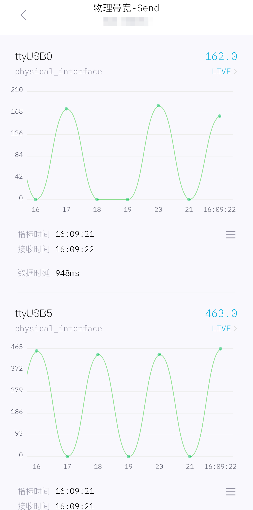
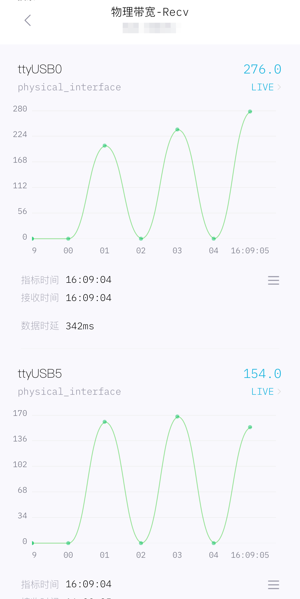
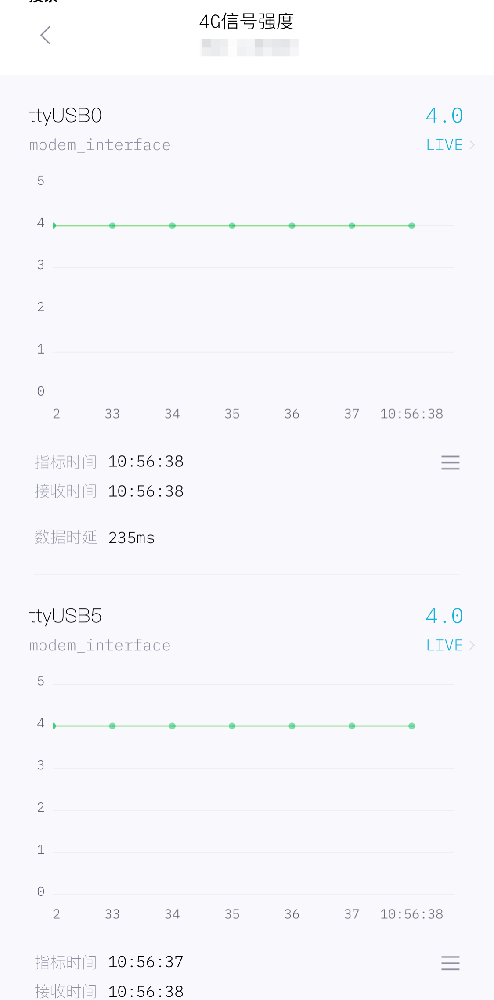

# 电商应用场景

港口应用为港口提供智能服务，核心通过AI技术做分类识别，与传统管理系统结合，打通接口，改变港口作业逻辑，逐步实现无人化。

| 问题                                                        | 解决方案         |
| ----------------------------------------------------------- | ---------------- |
| 可靠的网络来确保远程可控，同时存在AI互动场景，依赖大带宽&5G | 远程管控         |
| 远程控制，实现电路空开延迟、周期、联通策略                  | 远程设备信息管理 |
| 全局管理各个商场繁多且分散的设备                            | 实时无损监控     |

##### 解决方案一：远程管控

1.远程控制设备开关、设定延时策略；
2.web界面全局一键管理设备，无需现场升级处理。

##### 解决方案二：远程设备信息管理

实际探测、记录现场设备MAC地址，同时通过IEEE官方数据比对，显示其组织信息。

##### 解决方案三：实时无损监控

收集上报各类数据指标（信号、带宽、延迟、设备状态），展示亚秒级别数据。

