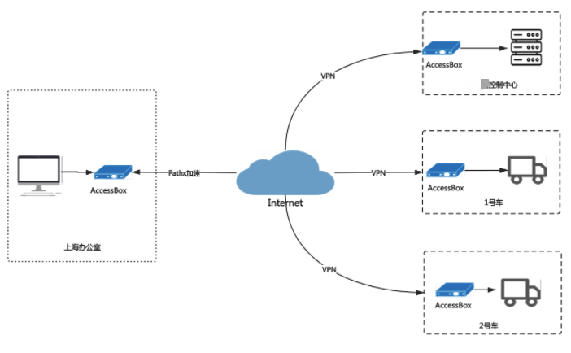

# 无人化港口场景

问题一：网络环境恶劣，容易造成“信息孤岛”

问题二：物理位置碎片化，无法进行集中化管理

问题三：港口IT管理落后，人工维护工作繁重

​                                   

##### 业务诉求分析：

###### AI识别业务场景中，需在各港口现场部署服务器的模式

1. 部署有Redis、MySQL等数据库业务，部分数据作为AI训练模型的数据源，因此需要不定期进行读写操作
2. PHP实现API接口，对接各类系统，PHP程序也需要频繁的更新
3. FTP服务，同时需要经常上传、下载各种日志、数据文件。

###### 需要有一个集中化管理平台，实现自动化升级、故障回滚、自动化监控告警等功能

1. 无网络环境，无法进行监控告警，只能通过巡检机会，人工去现场拷贝数据
2. 有网络环境，港口公网不稳定，经常出现连接中断、信号差的情况
3. 无稳定网络环境，告警、数据通过邮件回传，及时性差

##### 解决方案：

