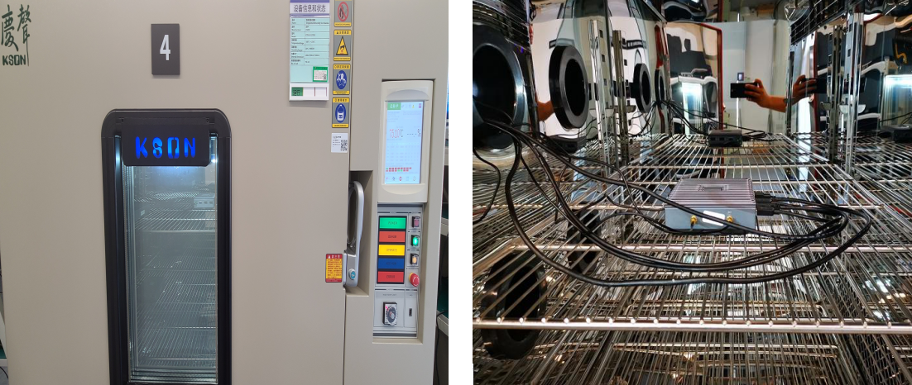
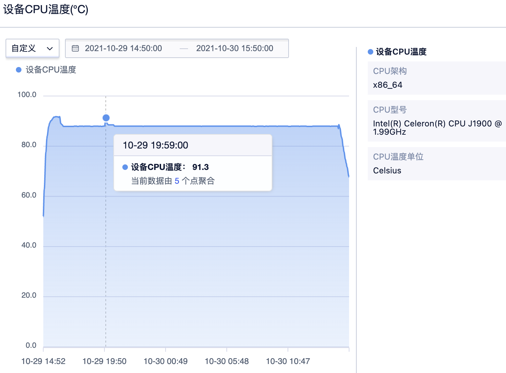
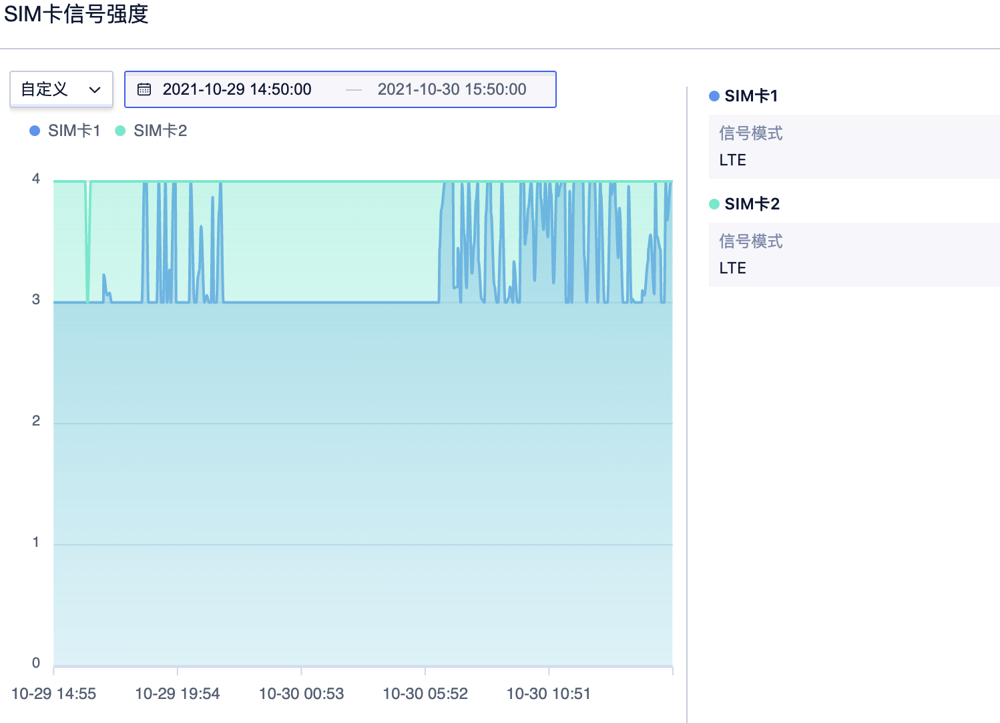
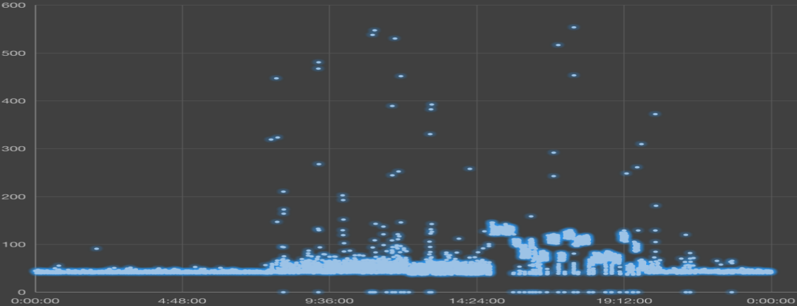
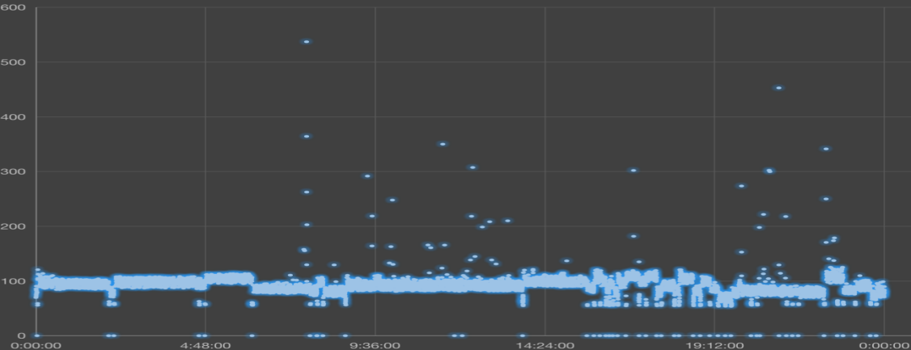
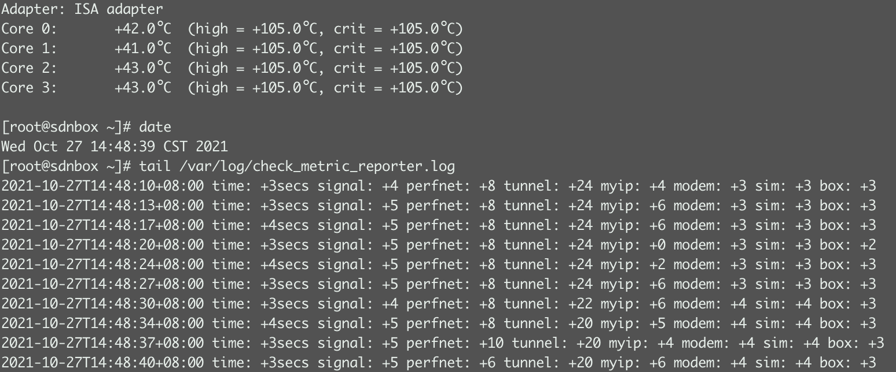

# 高温运行测试

#### 实验目的：

1、检验试件能否在长期的高温环境中储藏、操纵控制。
2、确定军民用设备在高温条件下储存和工作的适应性及耐久性以及高温下材料物理化学性能。

#### 参考标准:

IEC 60068-2-2:2007《电工电子产品环境试验 第2部分 试验B：高温》
注：IEC标准是 ( International Electrotechnical Commission)国际电工委员会标准的简称。

#### 测试日期: 
2021.10.29～2021.10.30

#### 试验场地: 
苏州源控电子科技有限公司-硬件可靠性实验室

#### 实验室环境:
温度: 25±10℃   湿度: 50±25 % RH

#### 测试设备:
温湿度实验箱 (YK-04)  设备品牌: 庆声科技股份有限公司   设备模型: KTHE-615TBS 

#### 测试条件:
1.测试温度: -30℃
2.温度变化率: 1℃/分钟 
3.系统状态: 运行 
4.测试时长: -30℃运行24小时 

#### 测试照片：

## CPU温度分析

###### 环境温度数据来源：温湿度实验箱(YK-04)

上图为Accessbox所处环境的温度数据，Accessbox在75摄氏度环境温度中运行24小时。

###### CPU温度数据来源：Accessbox控制台

上图为Accessbox在的温湿度实验箱中随环境温度变化而变化的CPU温度数据。

 数据分析：在环境温度为75℃时，UBox稳定运行，CPU温度稳定在91℃左右。

## 网络信号分析

###### 双卡4G信号数据来源：Accessbox控制台

上图为Accessbox在高温测试过程中（25℃>>75℃ >>25℃）的双卡4G信号，SIM卡1为中国移动4G物联网卡，SIM卡2为中国电信4G物联网卡。

 数据分析：整个实验过程中，中国电信4G信号稳定在4格，中国移动4G信号有些许波动，但都在3格以上。环境温度与SIM卡信号强度无直接关系。

## 网络延迟分析 

Accessbox通过ping指定ip来获取延迟数据。以此来判断网络质量好坏。测试期间ping两个指定ip的延迟数据，ping每个ip各3万次。

###### Ping 114.114.114.114（国内）延迟数据来源：Accessbox数据库

###### Ping 8.8.8.8（全球）延迟数据来源：Accessbox数据库

数据分析：整个测试过程中，ping 114.114.114.114延迟集中在50ms左右，ping 8.8.8.8延迟集中在100ms左右，网络延迟与温度无直接关系。

## 性能分析

UBox采集各项数据并写入本地。分指标统计每3s左右的插入量，以此项来判断盒子性能是否正常。

###### 常温（环温+23℃）环境下数据来源：Accessbox本地数据

数据分析：环境温度为75℃时，CPU温度稳定在91℃左右。此时Accessbox性能未受明显影响。数据采集、写入本地的速率与常温环境无明显差距。

## 综合分析：

###### 硬件实验室测试分析：
1. 硬件功能未受损。
2. 硬件未发现退化。
3. 性能保持不变，未见不可逆的物理损坏或退化。

###### UCloud功能测试分析：
1. UBox网络功能未受75℃环境温度影响。
2. 4G网络信号未受75℃环境温度影响。
3. 4G网络延迟未受75℃环境温度影响。
4. UBox性能未受75℃环境温度影响。

