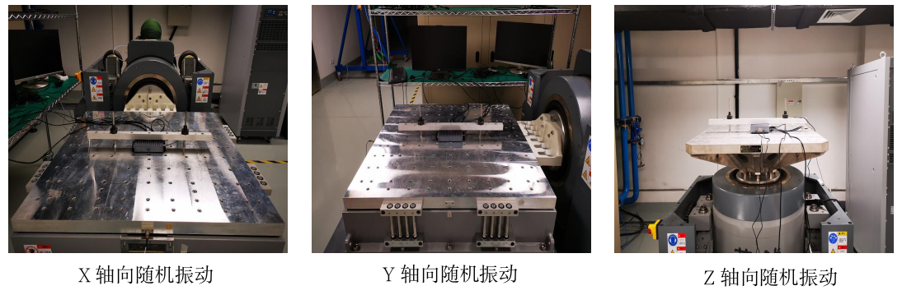
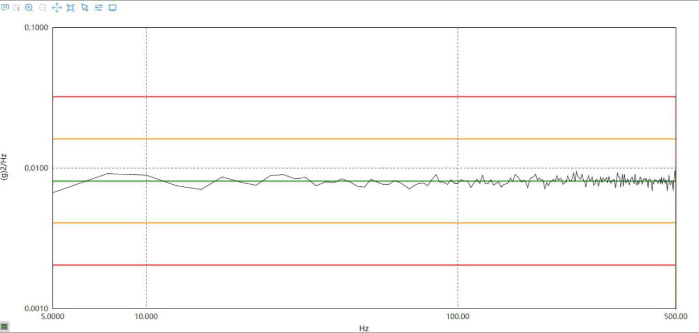
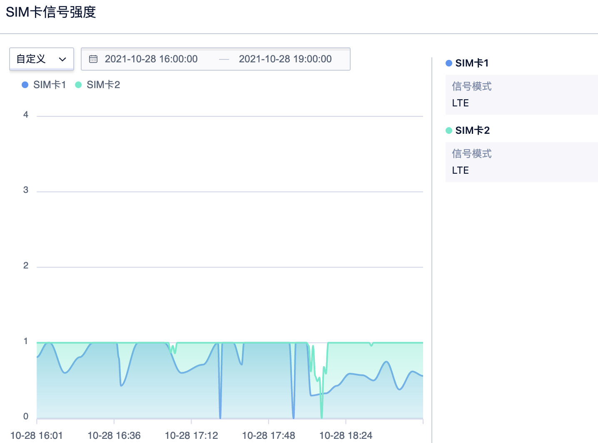

# 随机振动测试

#### 实验目的：
1. 模拟产品在运输、安装及使用环境下所遭遇到的各种振动环境影响，用来确定产品是否能承受各种环境振动。
2. 随机振动以模拟产品整体性结构耐震强度评估以及在包装状态下的运送环境。

#### 参考标准:
IEC 60068-2-64:2007《电工电子产品环境试验 第64部分 试验Fh：振动（随机）》
注：IEC标准是 ( International Electrotechnical Commission)国际电工委员会标准的简称。

#### 测试日期:
2021.10.28

#### 试验场地:
苏州源控电子科技有限公司-硬件可靠性实验室

#### 实验室环境:
温度: 25±10℃   湿度: 50±25 % RH

#### 测试设备:
振动试验机 (YK-06)  设备品牌: 苏州苏试试验仪器有限公司 设备模型: DC-2200-26

#### 测试条件:
1. 功率谱密度(PSD): 0.008G²/Hz, 总均方根加速度:2Grms 
2. 系统状态: 非操作模式 
3. 振动频率 : 5-500Hz 
4. 测试轴向: -X, -Y, -Z, X, Y, Z 轴
5. 测试时长: 0.5小时/轴

#### 测试照片：

## 振动数据分析：
###### 随机振动数据来源：振动试验机 (YK-06)

上图为Accessbox所处环境的振动数据，随机振动实验曲线。

## 信号数据分析
Accessbox双卡4G信号数据来源：Accessbox控制台

上图为Accessbox在正弦振动测试过程中的信号数据，SIM卡1为中国移动4G物联网卡，SIM卡2为中国电信4G物联网卡。

数据分析：振动实验室在地下二层，网络信号不好。整个测试过程中，中国电信4G物联网卡信号稳定在1格左右波动较少，中国移动4G物联网卡信号波动频率较高。

## 综合分析：

###### 硬件实验室测试分析：
1. 硬件功能未受损。
2. 硬件未发现退化。
3. 性能保持不变，未见不可逆的物理损坏或退化。

###### UCloud功能测试分析
1. 网络功能未受损。
2. 测试期间移动4G信号有波动，电信4G信号相对保持稳定。由于测试时间有限，无法证明是振动还是地下实验室环境导致信号波动。
3. 4G模组保持稳定连接，通信正常。