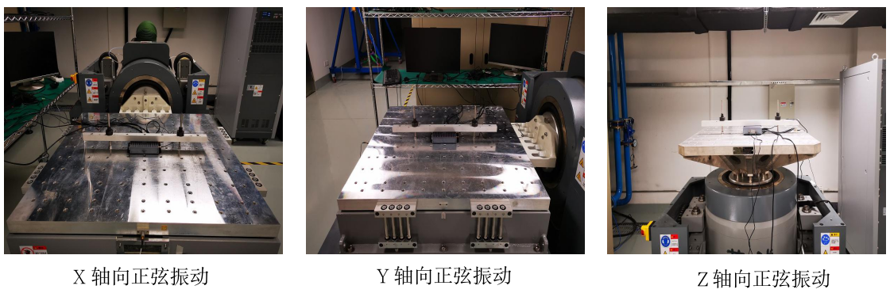
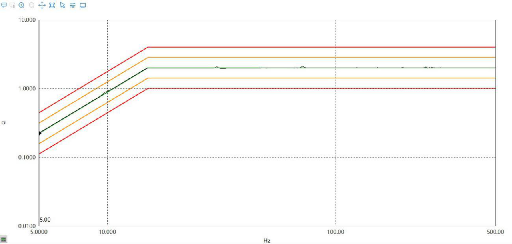
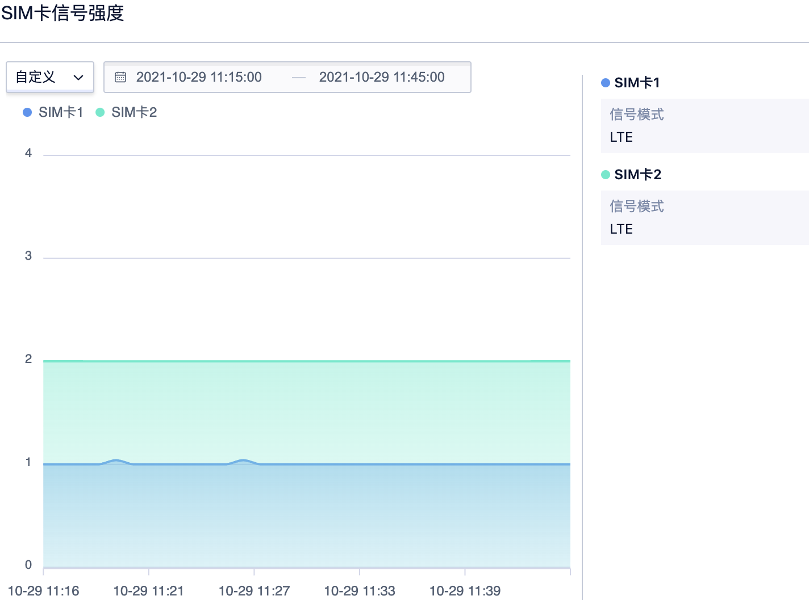

# 正弦振动测试

#### 实验目的：

1. 模拟产品在运输、安装及使用环境下所遭遇到的各种振动环境影响，用来确定产品是否能承受各种环境振动。
2. 正弦振动以模拟旋转、脉动、震荡所产生的振动以及产品结构共振频率分析和共振点驻留验证为主。

#### 参考标准：
IEC 60068-2-6:2007《电工电子产品环境试验 第6部分 试验Fc：振动（正弦）》
注：IEC标准是 ( International Electrotechnical Commission)国际电工委员会标准的简称。

#### 测试日期：
2021.10.29

#### 试验场地：
苏州源控电子科技有限公司-硬件可靠性实验室

#### 实验室环境：
温度: 25±10℃   湿度: 50±25 % RH

#### 测试设备：
振动试验机 (YK-06)  设备品牌: 苏州苏试试验仪器有限公司 设备模型: DC-2200-26

#### 测试条件：

1. 测试加速度：2G 
2. 测试频率：5-500Hz 
3. 位移值：4.4mm(振荡总振幅) 
4. 扫频速率：1 Oct/min 
5. 测试轴向：X轴、Y轴、 Z 轴
6. 测试次数：2周期/轴向

#### 测试照片：

## 振动数据分析

###### 正弦振动数据来源：振动试验机 (YK-06)

上图为 Accessbox所处环境的振动数据，正弦振动实验曲线。
## 信号数据分析：

###### 双卡4G信号数据来源：Accessbox控制台

上图为Accessbox在正弦振动测试过程中的信号数据，SIM卡1为中国移动4G物联网卡，SIM卡2为中国电信4G物联网卡。

数据分析：振动实验室在地下二层，网络信号不好，整个测试过程中，中国移动4G物联网卡信号稳定在1格，中国电信4G物联网卡信号稳定在两格。

## 综合分析：

###### 硬件实验室测试分析：

1. 硬件功能未受损。
2. 硬件未发现退化。
3. 性能保持不变，未见不可逆的物理损坏或退化。

###### UCloud功能测试分析：

1. 网络功能未受损。
2. 信号强度保持稳定。
3. 4G模组保持稳定连接，通信正常。